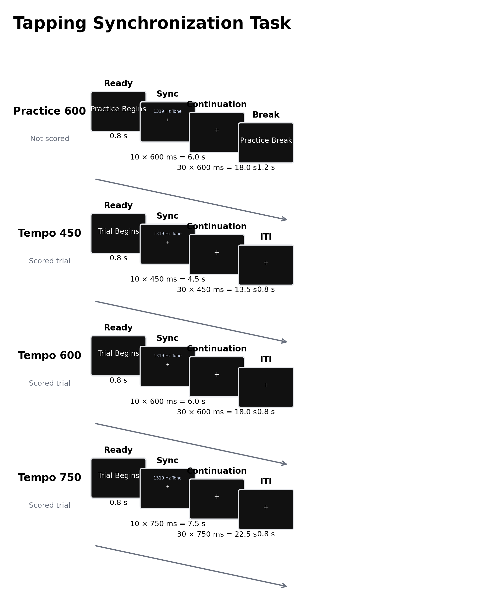

# 听觉—运动同步—继续拍击范式：预测性定时、内部节律维持及其测量边界

人类需要依据环境中的时间规律预测事件，并使动作在适当时刻发生。感觉运动同步（sensorimotor synchronization, SMS）研究常以听觉节拍和毫秒级动作序列为参照，将这种能力操作化为动作与外部节拍之间的时间耦合。等时节拍同步拍击能够测量外部线索驱动下的预测与误差校正；在节拍停止后继续维持同一速率，则进一步检验已建立的时间间隔表征能否脱离外部线索而持续指导动作。同步—继续拍击范式（synchronization–continuation tapping task）把两个阶段置于同一试次，因而可区分线索依赖的相位控制与无外部节拍时的速率维持，同时保留相同效应器和目标间隔，已成为研究节律预测、运动定时及其神经基础的经典方法（Repp, 2005; Repp & Su, 2013）。这种阶段分离并不意味着两个阶段分别对应单一心理过程：同步阶段也依赖内部预测，继续阶段仍包含运动执行、自我监测和对先前线索的记忆。对范式结果的有效解释必须同时考虑任务阶段、节拍速度、反应装置和所用指标。

## 1. 范式起源与理论发展

早期实验已观察到，参与者试图与规律声音同时反应时，动作并非对每个声音作简单反应，而会逐渐形成预期性的时间关系（Dunlap, 1910）。现代重复拍击研究的关键推进来自对相邻反应间隔结构的建模。Wing 与 Kristofferson（1973）提出时间保持器—运动延迟模型，将继续拍击的间隔变异分解为内部时间保持过程与动作执行延迟的贡献。该模型的重要方法学含义是：平均拍击间隔反映速率偏差，间隔序列的方差与自协方差则有助于区分时间生成噪声和运动噪声；仅报告总变异不足以确定误差来源。

在外部节拍存在时，核心测量由拍击时刻与对应刺激时刻之差构成。健康成人面对简单听觉节拍时常出现负平均不同步（negative mean asynchrony），即拍击平均早于声音数十毫秒。该现象支持预测性控制，但其大小也受听觉与躯体感觉反馈的加工时延、主观同时性及反应装置影响，不能直接等同于“内部时钟更快”（Aschersleben & Prinz, 1995; Repp, 2005）。连续同步还包含相位校正与周期校正：前者依据最近的时点误差迅速移动后续拍击相位，后者调整内部生成的间隔长度，通常更依赖对速度变化的觉察和注意（Repp & Su, 2013）。因此，平均有符号不同步、绝对不同步、不同步变异和扰动后的恢复速度分别回答不同问题，不宜合并为笼统的“同步能力”。

同步—继续设计通过撤去节拍器扩大了可识别的过程范围。同步阶段建立目标周期并持续提供相位参照；继续阶段失去外部参照后，平均拍击间隔相对目标间隔的偏差表征速率漂移，拍击间间隔（inter-tap interval, ITI）的标准差或变异系数表征节律稳定性。转换本身也是一个操作事件。Flach（2005）发现，从同步转入继续拍击后可出现短暂加速，即使参与者预先知道转换位置，这说明继续阶段并非对同步阶段的无扰动复制，阶段边界会改变反馈结构与控制策略。把继续阶段全部平均可能掩盖转换后的快速重整，因此在试次数和信噪比允许时，应分别分析早期转换期与后期稳定期。

## 2. 任务逻辑、流程与核心测量

经典试次先呈现等时听觉刺激，要求每个节拍对应一次手指动作；在若干拍后声音停止，参与者继续按已建立的速度产生规定数量或规定时长的动作。常用条件操控包括刺激起始间隔（inter-onset interval, IOI）、听觉或视觉模态、规则节拍或音乐、同步或反拍、相位/周期扰动以及反馈延迟。BAASTA（Battery for the Assessment of Auditory Sensorimotor and Timing Abilities）将该逻辑标准化为 10 个等时声音后的 30 个 IOI 继续拍击，并采用 450、600 和 750 ms 三种速度，以覆盖成人较容易同步的亚秒区间（Dalla Bella et al., 2017）。多速度设计可检验表现是否随目标周期系统变化，也能减少单一速度恰好接近个体自发运动速度所造成的偏倚。

同步阶段的有符号不同步为“拍击时刻减刺激时刻”：负值表示提前，正值表示滞后。其绝对值衡量不考虑方向的时间误差，但会混合稳定偏移与随机波动；不同步标准差或圆形统计的一致性更接近相位稳定度。继续阶段的平均 ITI 可与目标 IOI 比较以判断加速或减速，ITI 变异系数则在一定程度上控制平均速度差异。漏拍和多拍需要独立记录，因为按序配对在漏拍后可能改变后续拍击与参照节拍的对应关系。严谨分析通常保留原始刺激与拍击时间戳，预先规定配对、异常间隔排除、起始拍剔除和缺失处理规则。

范式一般不依赖正确/错误反馈；实时反馈会成为新的感觉事件并改变误差校正。练习用于确认一拍一击规则和装置使用，正式试次的条件顺序通常随机或平衡。同步时长必须足以进入稳定相位，继续时长则需在获得稳定性估计与避免疲劳、注意下降之间权衡。较长序列能提高 ITI 变异估计的精度，却也更容易出现漂移；较少重复会限制个体差异和重测分析。键盘、触摸屏、力传感器及音频输出的系统延迟不同，毫秒级不同步研究应测量或校准端到端延迟。在线方法可以获得有效的 SMS 数据，但需要专门的延迟估计、录音校准或质量筛查，普通浏览器时间戳不能自动视为实验室硬件的等价测量（Anglada-Tort et al., 2022）。

## 3. 行为与神经科学证据

### 3.1 预测、校正与内部速率维持

负平均不同步和对局部节拍扰动的快速修正共同表明，稳定同步依赖前馈预测与反馈校正的结合。提前量会随速度、感觉模态、音乐训练和反馈条件改变，因而更适合作为特定条件下的相位偏移，而非跨装置、跨人群不加校准的能力分数（Aschersleben & Prinz, 1995; Repp & Su, 2013）。注意同样不是恒定背景变量。Versaci 与 Laje（2021）通过节奏扰动和脑电事件相关电位发现，将注意明确指向时间信息可提高同步准确性和再同步效率。这意味着组间不同步差异可能同时反映时间预测、注意分配和任务理解。

继续拍击主要约束内部周期表征和运动定时，但仍受同步阶段形成的策略影响。平均 ITI 的漂移提供方向性速率信息，ITI 变异提供稳定性信息，两者可以分离：个体可能维持正确平均速度却逐拍波动较大，也可能拍击稳定但整体偏快。Wing–Kristofferson 模型进一步表明，相邻 ITI 的负协方差可由共享的运动延迟项产生，因此总变异不能全部归因于中央计时（Wing & Kristofferson, 1973）。同步与继续的差值也不是纯粹的“外部—内部计时”对比，因为声音撤除同时改变听觉输入、误差信号、注意需求和阶段转换。Flach（2005）的转换效应及近期时间分辨分析均支持把阶段内动态纳入模型，而非只比较两个阶段的总体均值（Kim et al., 2026）。

### 3.2 fMRI 与 EEG 所揭示的阶段差异

任务相关 fMRI 显示，简单节律动作涉及初级运动和躯体感觉皮层、辅助运动区、前运动区、小脑、基底节以及额顶区域，但区域活动不能直接替代特定心理构念。Jantzen 等（2004）在同步/反拍与继续条件中发现，建立节律时采用同步还是反拍会改变后续定时网络；其同步条件下，继续阶段相对有声阶段的主要差异是听觉相关活动下降。这一结果说明先前动作—声音关系可以延续到声音消失以后，也提醒研究者不能假定继续阶段必然招募一套完全不同的“内部时钟”系统。

更大样本的时间分辨 fMRI 研究进一步区分了阶段早期与晚期。Kim 等（2026）报告，同步和继续开始后的最初数秒均伴随较大的 ITI 波动及更广泛的感觉运动、额—顶—颞和显著性网络活动；表现稳定后活动范围缩小，而继续阶段相对同步阶段表现出更广泛的自我监测相关活动。该发现与阶段转换时重新调整内部模型的解释相容，但 BOLD 信号的时间滞后和相关性设计不支持对某一脑区作必要性或因果判断。两项 fMRI 结果的差异还表明，基线条件、阶段切分、动作要求与分析时间尺度会显著影响“同步对继续”对比。

EEG 提供了毫秒尺度的补充证据。时间导向注意会改变与听觉刺激相关的事件相关电位，并提高行为校正效率；然而节拍诱发、动作准备、按键后的躯体感觉与听觉反应在连续拍击中高度重叠，必须通过成分分离或适当对照识别（Versaci & Laje, 2021）。因此，EEG 可用于刻画预测和误差校正的时间进程，但头皮信号不能单独精确定位深部基底节或小脑来源。fMRI 与 EEG 的一致结论是同步依赖分布式听觉—运动耦合及动态校正，而不是单一脑区或单一振荡指标。

## 4. 方法发展与主要应用

BAASTA 将同步、继续、节拍知觉及自适应拍击纳入同一测评体系，使研究者能够区分节拍知觉、外部同步和无提示维持等相互关联但不等同的能力（Dalla Bella et al., 2017）。其移动版本提供 18–87 岁成人常模并评估重测信度，推动了实验室外测量；研究同时强调，触摸屏采样率和音频/触摸延迟仍需专门校准（Dalla Bella et al., 2024）。这类标准化促进了从平均组效应转向个体节律特征，但完整测评的证据不能自动迁移到仅含少量同步—继续试次的缩短版本。

发展研究显示，SMS 的精度与稳定性在儿童期持续成熟。对 305 名 6–11 岁儿童的研究发现，拍击变异随年龄下降，6–9 岁变化尤其明显；音乐与节拍器条件产生不同的准确性和变异模式，说明刺激复杂度会影响发展结论（Carrer et al., 2023）。老年与神经认知障碍研究则呈现速度依赖性：接近自发速度的简单同步有时保留，而较慢、较快或需要继续维持的条件更可能揭示变异增大；现有证据在疾病类型、速度和任务版本间具有异质性（von Schnehen et al., 2022）。

临床应用的价值主要在于分解不同来源的定时异常，而非单项诊断。小脑性共济失调与帕金森病患者在不同 IOI 和阶段表现出不同的准确性、变异及提前/滞后模式，支持小脑与基底节功能障碍对运动定时产生不同影响；这些差异仍会受到药物状态、动作能力和目标速度调节（Claassen et al., 2013）。因此，同步—继续指标可用于描述表型、选择节律训练参数或追踪变化，但不应脱离听力、运动能力、认知状态和装置特性作疾病归属判断。

## 5. 信度、效度与解释边界

范式具有明确的表面效度和操作效度：同步阶段直接量化动作—刺激关系，继续阶段直接量化无外部线索时的速率与稳定性。构念效度仍取决于指标选择。有符号不同步同时包含预测偏移和装置延迟，绝对不同步混合系统偏移与波动，ITI 变异同时包含时间保持与运动执行噪声。采用多速度、原始时间戳、装置校准及分阶段模型，能够缩小但不能完全消除这些歧义。

个体级信度是更严格的限制。BAASTA 的两周重测研究中，节拍器和音乐同步的准确性/一致性具有较好至优秀的组内相关，而同步—继续任务的运动变异指标重测信度较差（Bégel et al., 2018）。较大成人样本的移动版研究同样发现，部分条件下 ITI 变异系数的 ICC 低于 .35，而节拍同步相关指标更稳定（Dalla Bella et al., 2024）。稳定的平均负不同步或显著的组间差异不保证可靠的个体排序。若研究目标是个体差异、纵向疗效或临床筛查，应增加每个速度的重复数，报告测量误差或最小真实变化，并优先使用已验证的复合或同步一致性指标；仅凭少量继续拍击试次的 CV 不宜作个体诊断。

最后，速度、刺激模态、效应器和反馈方式限定外部效度。亚秒等时音调上的键盘拍击主要检验离散手指动作的听觉定时，不能直接代表音乐中的层级节拍、连续全身运动或人际协调。任务成绩也可能受注意、工作记忆、音乐训练、年龄、听觉敏锐度和精细运动能力影响。神经影像活动差异支持相关网络参与，但不能单独证明某结构对同步或继续定时具有因果作用。

## 6. TaskBeacon 中的任务实现

### 6.1 任务资源与访问入口

| 资源 | ID | 用途 | 地址 |
|---|---|---|---|
| PsychoPy 完整任务 | T000044 | 中文行为实验实现；连续记录同步与继续阶段的空格键拍击 | [源码仓库](https://github.com/TaskBeacon/T000044-tapping-synchronization-task) |
| 浏览器行为伴随版 | H000044 | 保留相同条件与节拍数的网页体验；按预期节拍拆分响应捕获阶段，不替代实验室时延校准 | [源码仓库](https://github.com/TaskBeacon/H000044-tapping-synchronization-task) |
| 公共运行入口 | H000044 | 在线体验浏览器版本 | [运行任务](https://taskbeacon.github.io/psyflow-web/?task=H000044-tapping-synchronization-task) |

### 6.2 实现流程与关键参数

TaskBeacon 当前版本为中文行为任务。参与者阅读指导语后，以空格键开始并作为唯一拍击键。一个 600 ms IOI 的练习试次先行；正式阶段包含 6 个试次，450、600、750 ms 条件各 2 次并在区组内随机排列。每次先呈现 0.8 s 准备画面，随后播放 10 个 1319 Hz、100 ms 的等时声音并要求同步按键；声音停止后，参与者在中央注视点下继续拍击 30 个目标间隔。练习后呈现 1.2 s 过渡画面，正式试次间为 0.8 s 注视间隔。任务不提供逐试次正确性反馈、积分或奖励，也不使用自适应阶梯。

| 参数 | 当前实现 | 对测量的含义 |
|---|---|---|
| 正式条件 | 450、600、750 ms，各 2 次 | 比较亚秒范围内的速度效应 |
| 同步阶段 | 10 个节拍；4.5、6.0 或 7.5 s | 建立外部相位关系与目标周期 |
| 继续阶段 | 30 个目标间隔；13.5、18.0 或 22.5 s | 测量无声条件下的速率漂移与 ITI 稳定性 |
| 反应与反馈 | 空格键；无逐试次反馈 | 键盘为手指拍击代理，需考虑输入延迟 |
| 主要输出 | 同步有符号/绝对不同步、继续 ITI 均值/CV、漏拍与多拍 | 分别描述相位偏移、误差幅度、速率、稳定性和反应完整性 |

**图 1. TaskBeacon 同步—继续拍击流程。** 练习条件固定为 600 ms：0.8 s 准备后，以 600 ms IOI 呈现 10 个 1319 Hz、100 ms 节拍声（6.0 s），参与者在整个同步窗口内每拍按一次空格键；声音停止后进入 30 个目标间隔的无声继续窗口（18.0 s），最后为 1.2 s 练习过渡。正式条件为 450、600 和 750 ms，各重复 2 次且随机排列；相应同步窗口为 4.5、6.0、7.5 s，继续窗口为 13.5、18.0、22.5 s，之后均有 0.8 s 试次间隔。正式试次不呈现正确性或积分反馈。实现按记录顺序将拍击与预期节拍配对，计算同步有符号及绝对不同步；继续阶段计算相邻拍击的 ITI 均值与变异系数，并记录漏拍和多拍。条件顺序仅作平衡随机化，不根据表现调整速度或时长。

该实现与 BAASTA 同步—继续子任务在三种 IOI、10 个有声节拍和 30 个继续间隔上保持一致（Dalla Bella et al., 2017）。其正式数据由每种速度 2 次试次构成，适合教学、范式复现和初步组水平比较；若用于稳定的个体差异估计，应依据研究目标增加重复并校准音频输出到按键登记的端到端时延。浏览器伴随版保留任务表面结构，但响应捕获方式与连续 PsychoPy 记录不同，因而更适合作为行为预览或经独立时延验证后的在线研究入口。

## 参考文献

Anglada-Tort, M., Harrison, P. M. C., & Jacoby, N. (2022). REPP: A robust cross-platform solution for online sensorimotor synchronization experiments. *Behavior Research Methods, 54*(5), 2271–2285. https://doi.org/10.3758/s13428-021-01722-2

Aschersleben, G., & Prinz, W. (1995). Synchronizing actions with events: The role of sensory information. *Perception & Psychophysics, 57*(3), 305–317. https://doi.org/10.3758/BF03213056

Bégel, V., Verga, L., Benoit, C.-E., Kotz, S. A., & Dalla Bella, S. (2018). Test-retest reliability of the Battery for the Assessment of Auditory Sensorimotor and Timing Abilities (BAASTA). *Annals of Physical and Rehabilitation Medicine, 61*(6), 395–400. https://doi.org/10.1016/j.rehab.2018.04.001

Carrer, L. R. J., Pompéia, S., & Miranda, M. C. (2023). Sensorimotor synchronization with music and metronome in school-aged children. *Psychology of Music, 51*(2), 523–540. https://doi.org/10.1177/03057356221100286

Claassen, D. O., Jones, C. R. G., Yu, M., Dirnberger, G., Malone, T., Parkinson, M., Giunti, P., Kubovy, M., & Jahanshahi, M. (2013). Deciphering the impact of cerebellar and basal ganglia dysfunction in accuracy and variability of motor timing. *Neuropsychologia, 51*(2), 267–274. https://doi.org/10.1016/j.neuropsychologia.2012.09.018

Dalla Bella, S., Farrugia, N., Benoit, C.-E., Bégel, V., Verga, L., Harding, E. E., & Kotz, S. A. (2017). BAASTA: Battery for the Assessment of Auditory Sensorimotor and Timing Abilities. *Behavior Research Methods, 49*(3), 1128–1145. https://doi.org/10.3758/s13428-016-0773-6

Dalla Bella, S., Foster, N. E. V., Laflamme, H., Zagala, A., Melissa, K., Komeilipoor, N., Blais, M., Rigoulot, S., & Kotz, S. A. (2024). Mobile version of the Battery for the Assessment of Auditory Sensorimotor and Timing Abilities (BAASTA): Implementation and adult norms. *Behavior Research Methods, 56*(4), 3737–3756. https://doi.org/10.3758/s13428-024-02363-x

Dunlap, K. (1910). Reaction to rhythmic stimuli with attempt to synchronize. *Psychological Review, 17*(6), 399–416. https://doi.org/10.1037/h0074736

Flach, R. (2005). The transition from synchronization to continuation tapping. *Human Movement Science, 24*(4), 465–483. https://doi.org/10.1016/j.humov.2005.09.005

Jantzen, K. J., Steinberg, F. L., & Kelso, J. A. S. (2004). Brain networks underlying human timing behavior are influenced by prior context. *Proceedings of the National Academy of Sciences of the United States of America, 101*(17), 6815–6820. https://doi.org/10.1073/pnas.0401300101

Kim, D.-J., Bolbecker, A. R., Moussa-Tooks, A. B., Wisner, K. M., O’Donnell, B. F., Gildea, E. L., & Hetrick, W. P. (2026). Distinct neural signatures in a sensorimotor synchronization-continuation task. *Imaging Neuroscience, 4*, IMAG.a.1100. https://doi.org/10.1162/IMAG.a.1100

Repp, B. H. (2005). Sensorimotor synchronization: A review of the tapping literature. *Psychonomic Bulletin & Review, 12*(6), 969–992. https://doi.org/10.3758/BF03206433

Repp, B. H., & Su, Y.-H. (2013). Sensorimotor synchronization: A review of recent research (2006–2012). *Psychonomic Bulletin & Review, 20*(3), 403–452. https://doi.org/10.3758/s13423-012-0371-2

Versaci, L., & Laje, R. (2021). Time-oriented attention improves accuracy in a paced finger-tapping task. *European Journal of Neuroscience, 54*(1), 4212–4229. https://doi.org/10.1111/ejn.15245

von Schnehen, A., Hobeika, L., Huvent-Grelle, D., & Samson, S. (2022). Sensorimotor synchronization in healthy aging and neurocognitive disorders. *Frontiers in Psychology, 13*, 838511. https://doi.org/10.3389/fpsyg.2022.838511

Wing, A. M., & Kristofferson, A. B. (1973). The timing of interresponse intervals. *Perception & Psychophysics, 13*(3), 455–460. https://doi.org/10.3758/BF03205802
